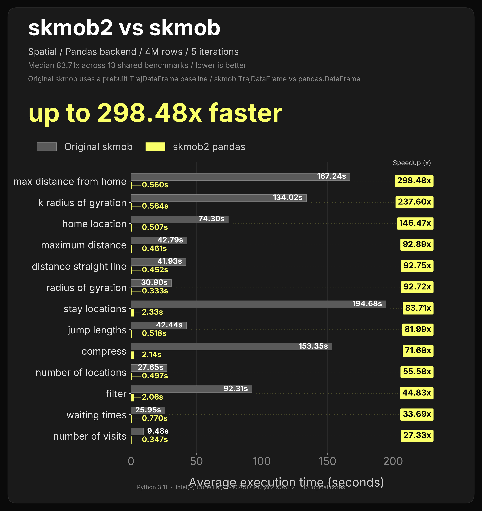
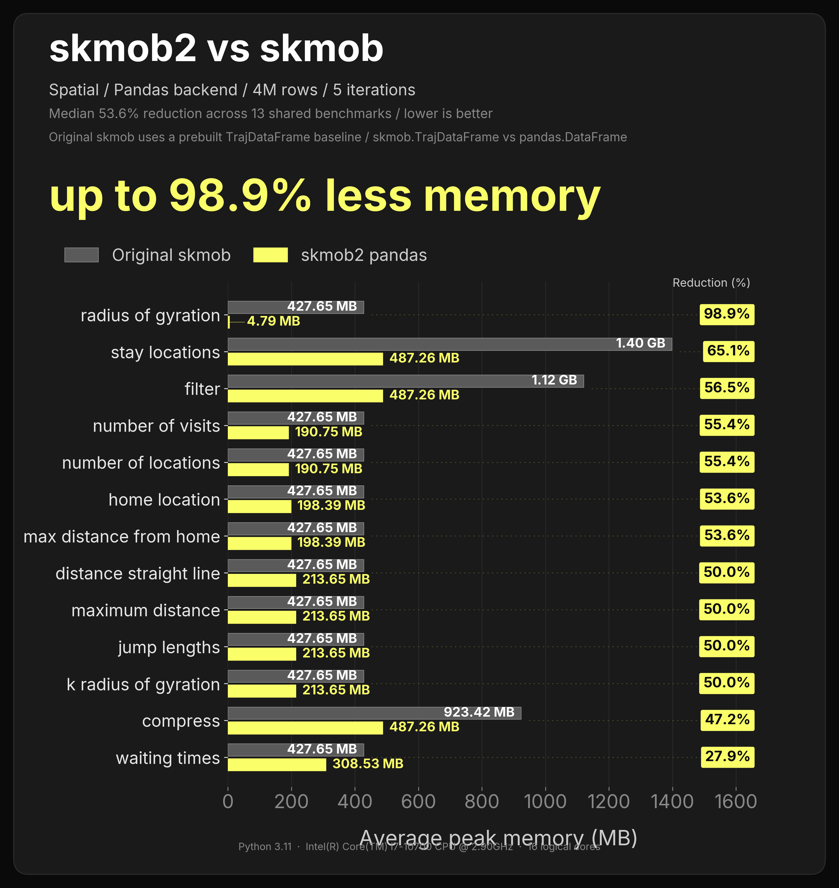
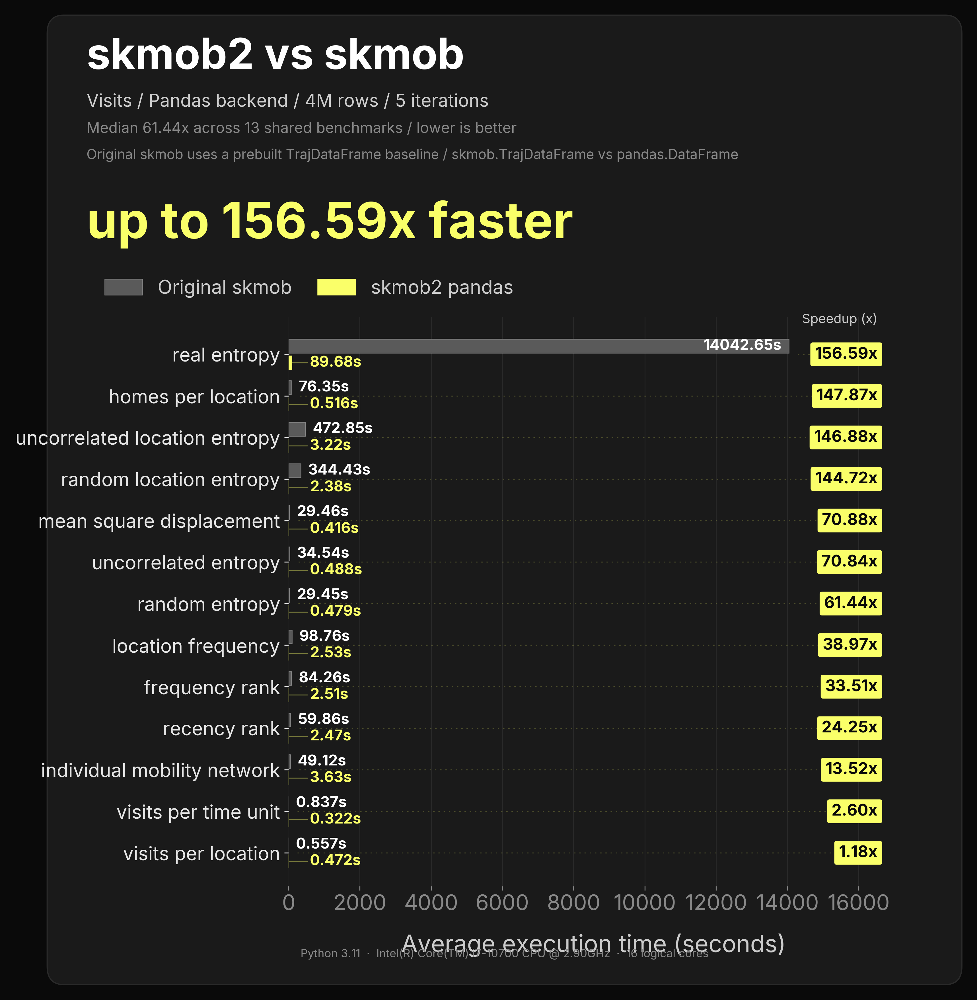

# Pandas benchmark plots

These plots collect the largest pandas benchmark runs that directly compare skmob2 with scikit-mobility (`skmob`). They are useful as a quick visual snapshot of skmob2 behavior on 4M-row trajectory workloads.

The numbers are environment-specific, so they should be read as benchmark evidence for this run rather than as a universal performance guarantee.

### Spatial operations

### Spatial memory

### Visit detection

