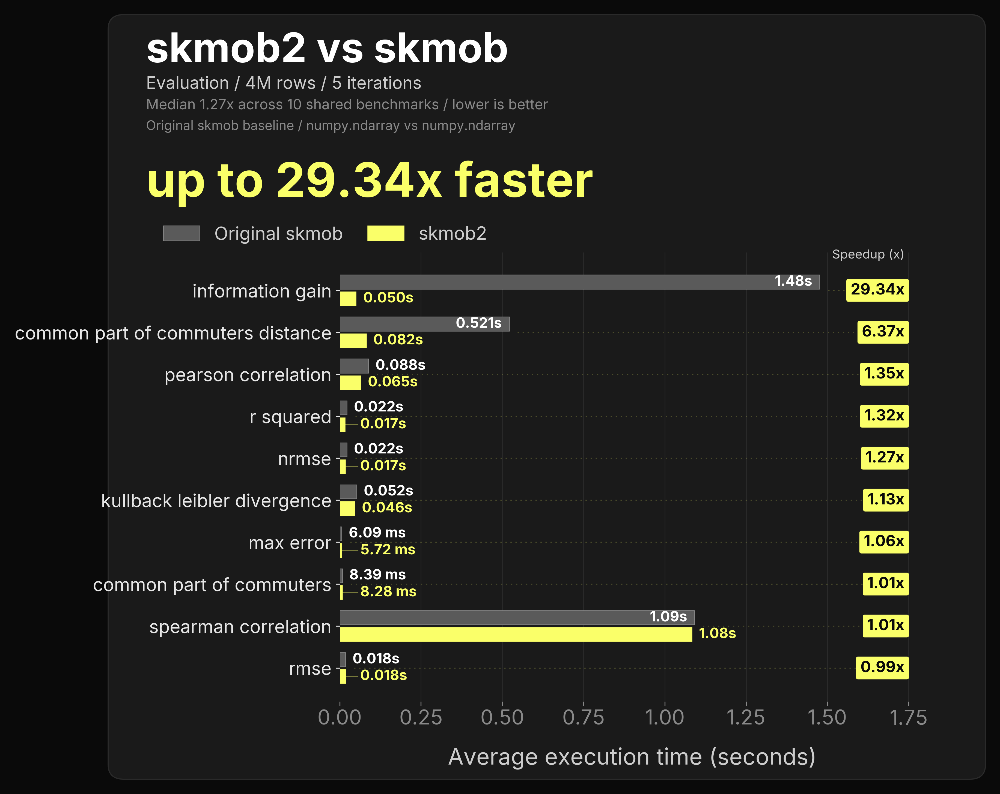
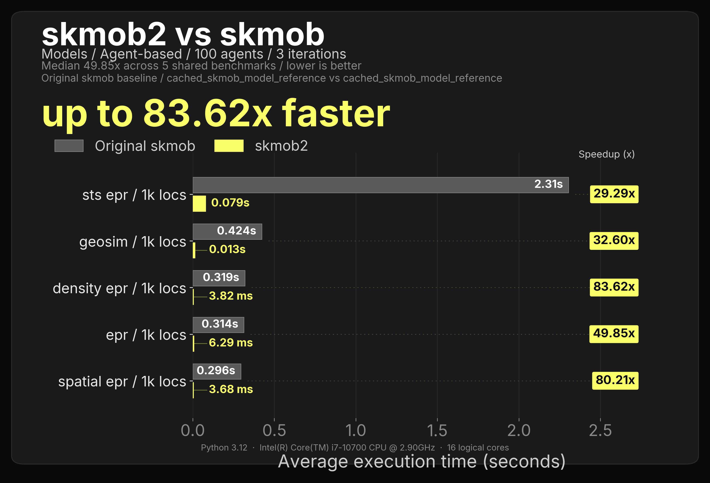
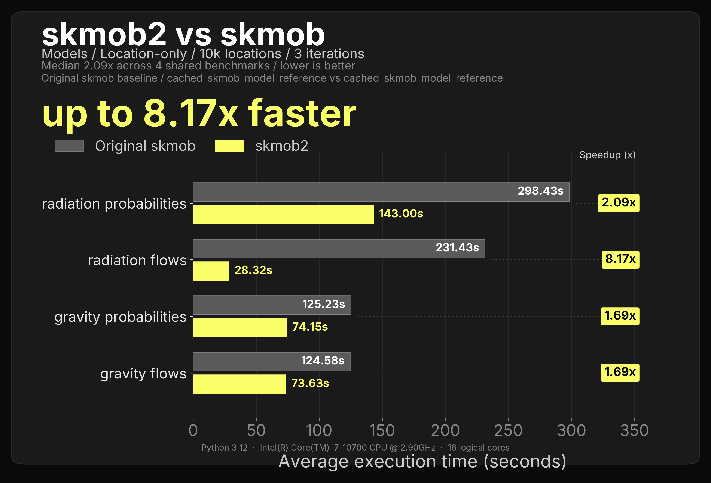
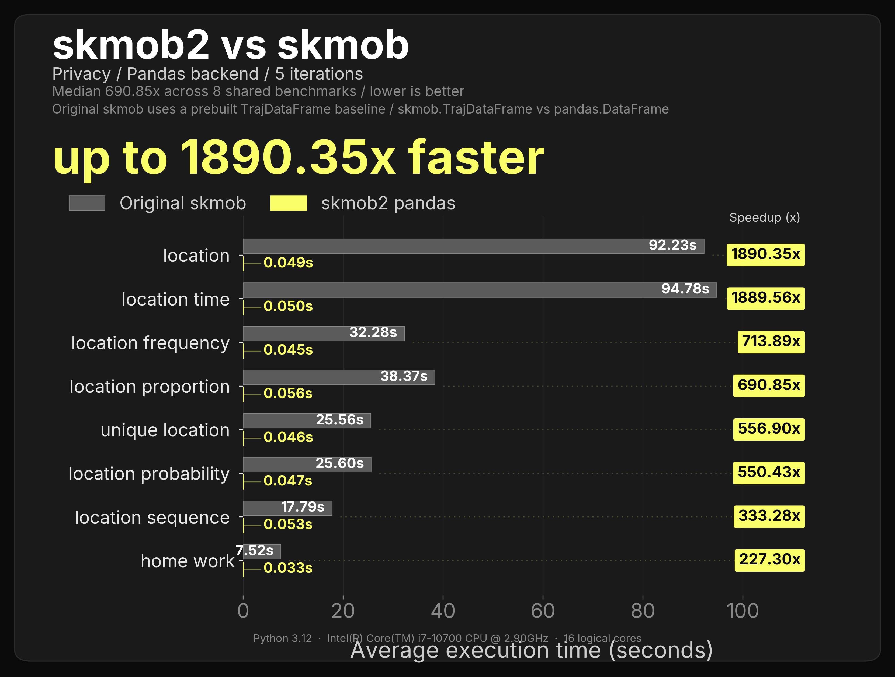
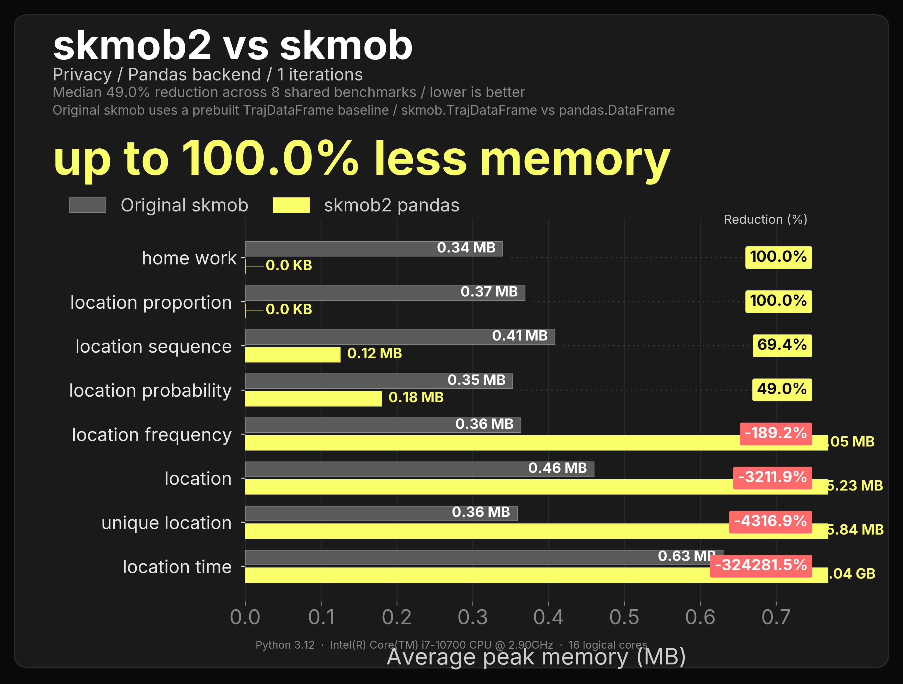
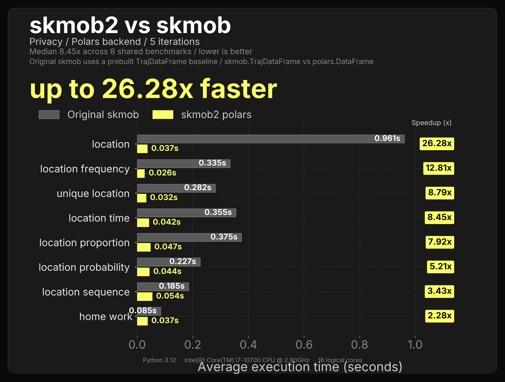
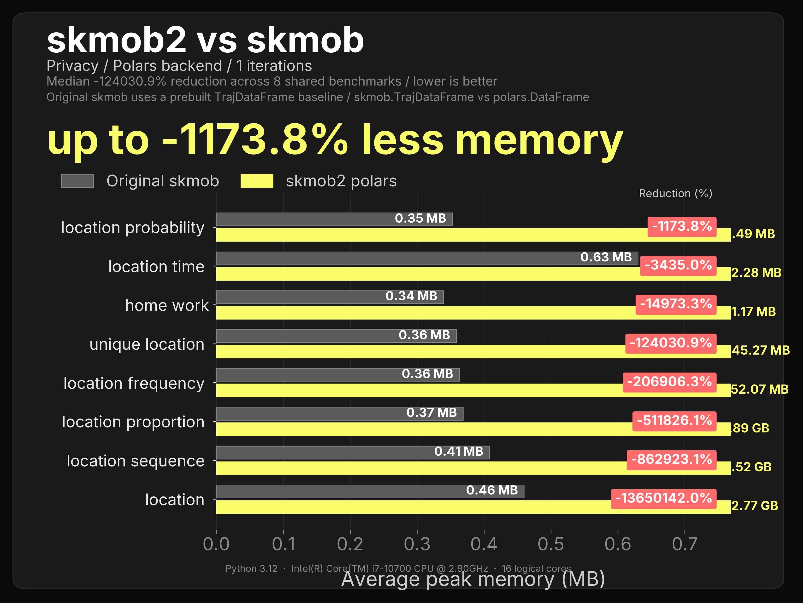
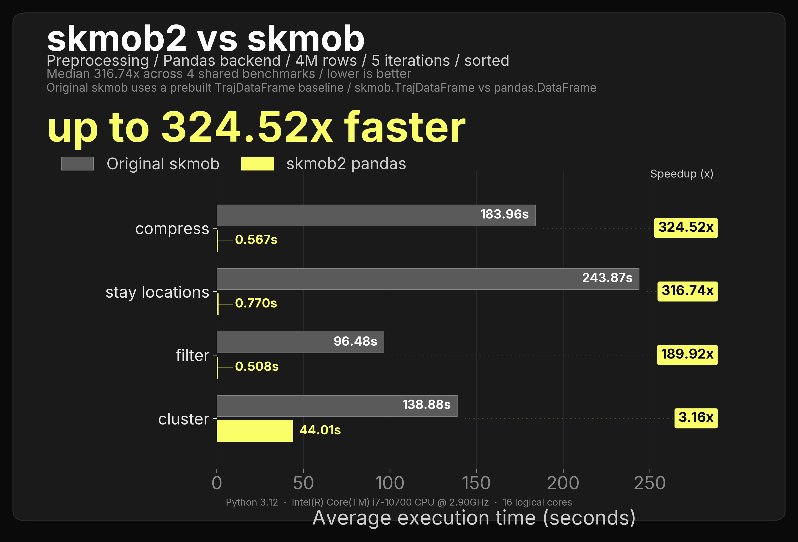
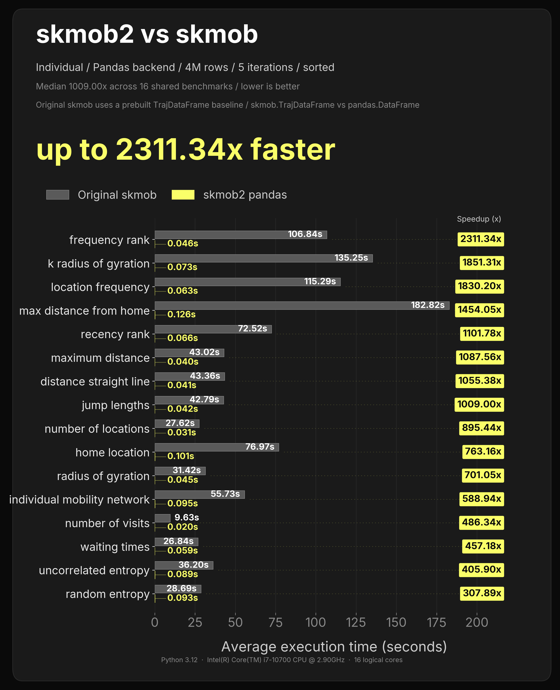
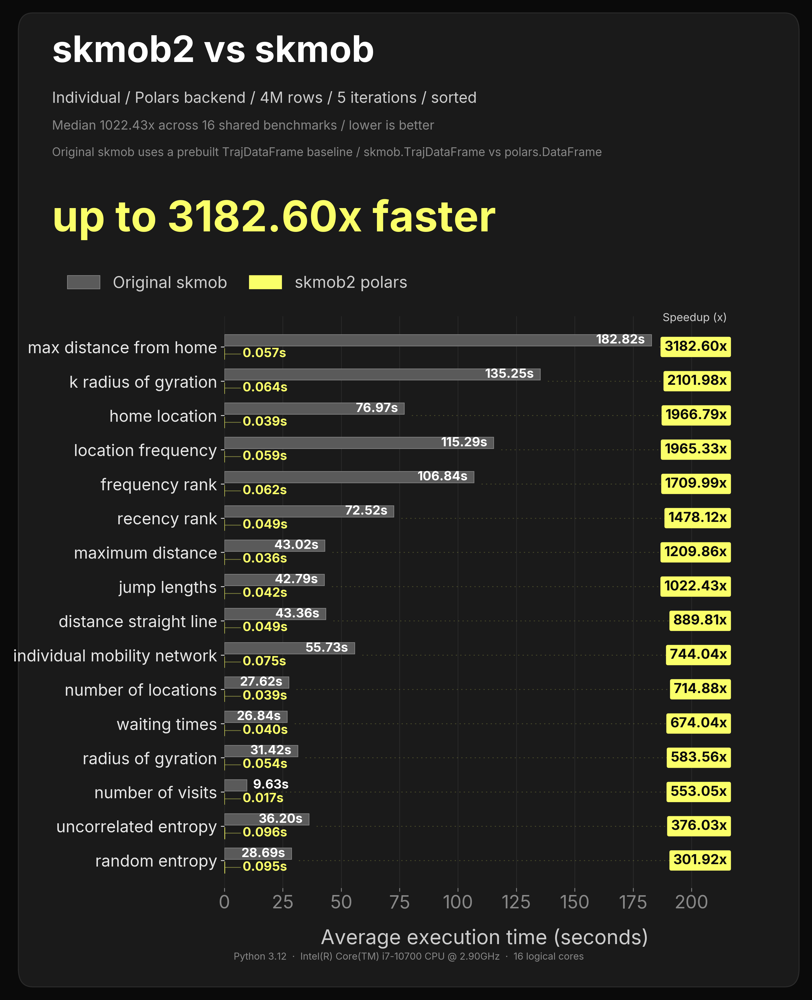

# Benchmark Results

These plots collect the largest benchmark runs that directly compare skmob2 with scikit-mobility (`skmob`). They are useful as a quick visual snapshot of skmob2 behavior on 4M-row trajectory workloads.

The numbers are environment-specific, so they should be read as benchmark evidence for this run rather than as a universal performance guarantee.

## Preprocessing

#### Preprocessing - Pandas (Speed)

#### Preprocessing - Pandas (Memory) (Still needs adjusts)

#### Preprocessing - Polars (Speed)

#### Preprocessing - Polars (Memory) (Still needs adjusts)

## Measures - Individual

#### Measures - Individual - Pandas (Speed)

#### Measures - Individual - Pandas (Memory) (Still needs adjusts)

#### Measures - Individual - Polars (Speed)

#### Measures - Individual - Polars (Memory) (Still needs adjusts)

## Measures - Collective

#### Measures - Collective - Pandas (Speed)

#### Measures - Collective - Pandas (Memory) (Still needs adjusts)

#### Measures - Collective - Polars (Speed)

<!-- #### Measures - Collective - Polars (Memory) (Still needs adjusts)
 -->

## Measures - Evaluation

#### Measures - Evaluation - (Speed) - Mostly numpy/scipy wrappers

<!-- 
#### Measures - Evaluation - (Memory) (Still needs adjusts)
 -->

## Models

#### Models Agents - Speed

#### Models Agents - Speed (No rust core yet...)

## Privacy

#### Privacy - Pandas (Speed)

<!-- #### Privacy - Pandas (Memory) (Still needs adjusts)
 -->

#### Privacy - Polars (Speed)

<!-- #### Privacy - Polars (Memory) (Still needs adjusts) -->
<!--  -->

## Pre-Sorted Benchmark Results

These refer to special metrics which benefit from sorted paths.

### Preprocessing

#### Preprocessing - Pandas (Speed)

<!-- #### Preprocessing - Pandas (Memory) (Still needs adjusts)
 -->

#### Preprocessing - Polars (Speed)

<!-- #### Preprocessing - Polars (Memory) (Still needs adjusts)
 -->

## Measures - Individual

#### Measures - Individual - Pandas (Speed)

<!-- #### Measures - Individual - Pandas (Memory) (Still needs adjusts)
 -->

#### Measures - Individual - Polars (Speed)

<!-- #### Measures - Individual - Polars (Memory) (Still needs adjusts)
 -->

## Measures - Collective

#### Measures - Collective - Pandas (Speed)

<!-- #### Measures - Collective - Pandas (Memory) (Still needs adjusts)
 -->

#### Measures - Collective - Polars (Speed)

<!-- #### Measures - Collective - Polars (Memory) (Still needs adjusts)
 -->

