# Benchmark Results

These plots collect the largest benchmark runs that directly compare skmob2 with scikit-mobility (`skmob`). They are useful as a quick visual snapshot of skmob2 behavior on 4M-row trajectory workloads.

The numbers are environment-specific, so they should be read as benchmark evidence for this run rather than as a universal performance guarantee.

## Preprocessing

#### Preprocessing - Pandas (Speed)
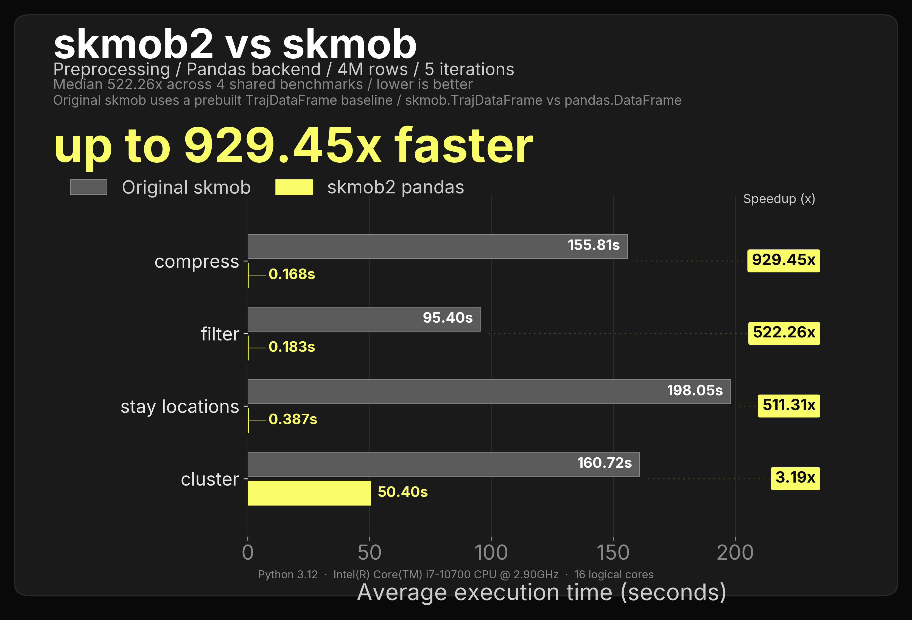

#### Preprocessing - Pandas (Memory)
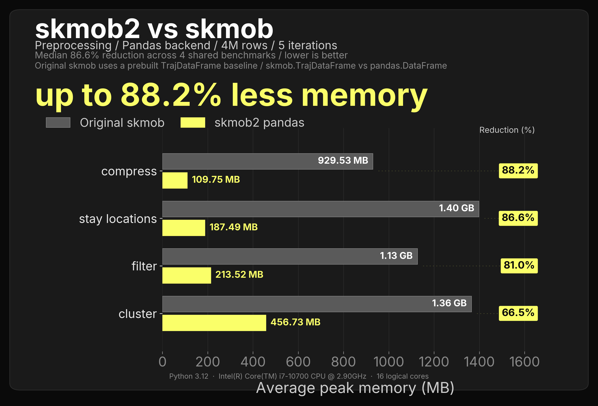

#### Preprocessing - Polars (Speed)
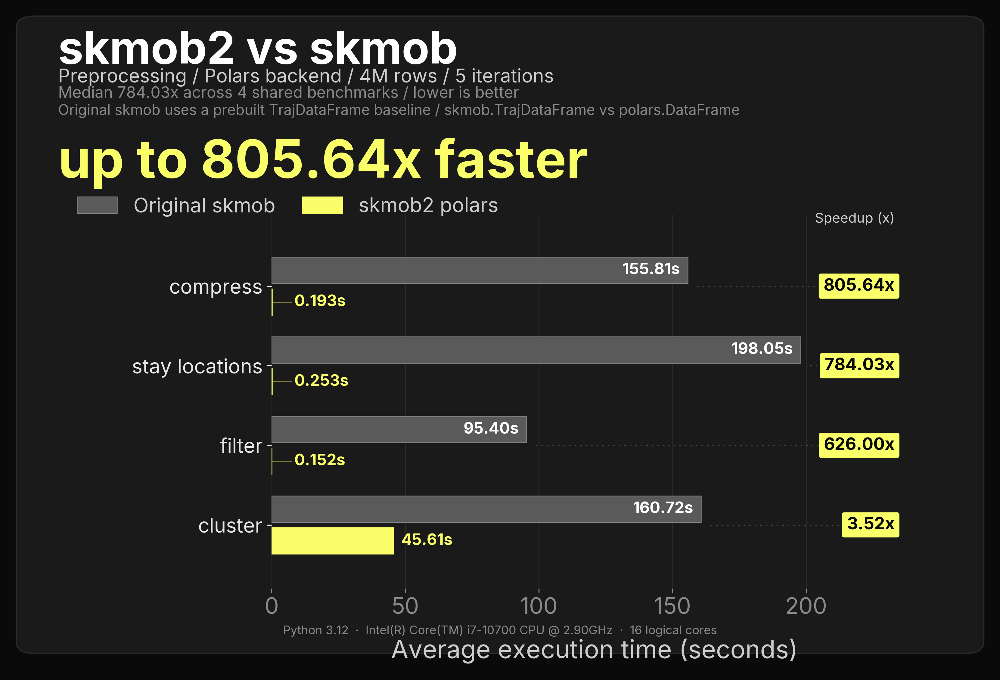

#### Preprocessing - Polars (Memory)
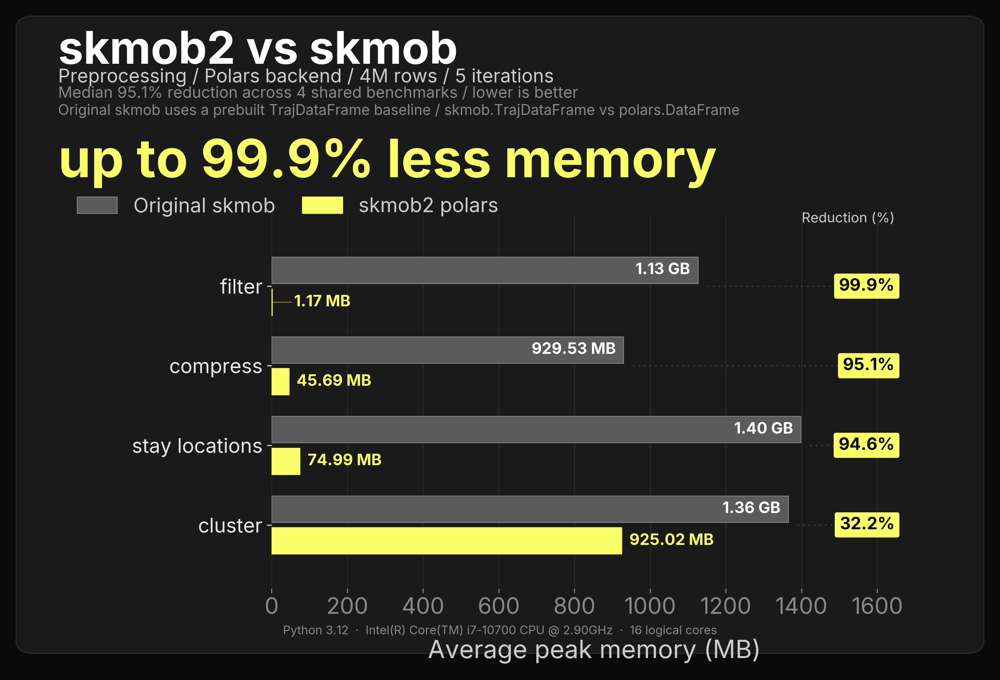

## Measures - Individual

#### Measures - Individual - Pandas (Speed)
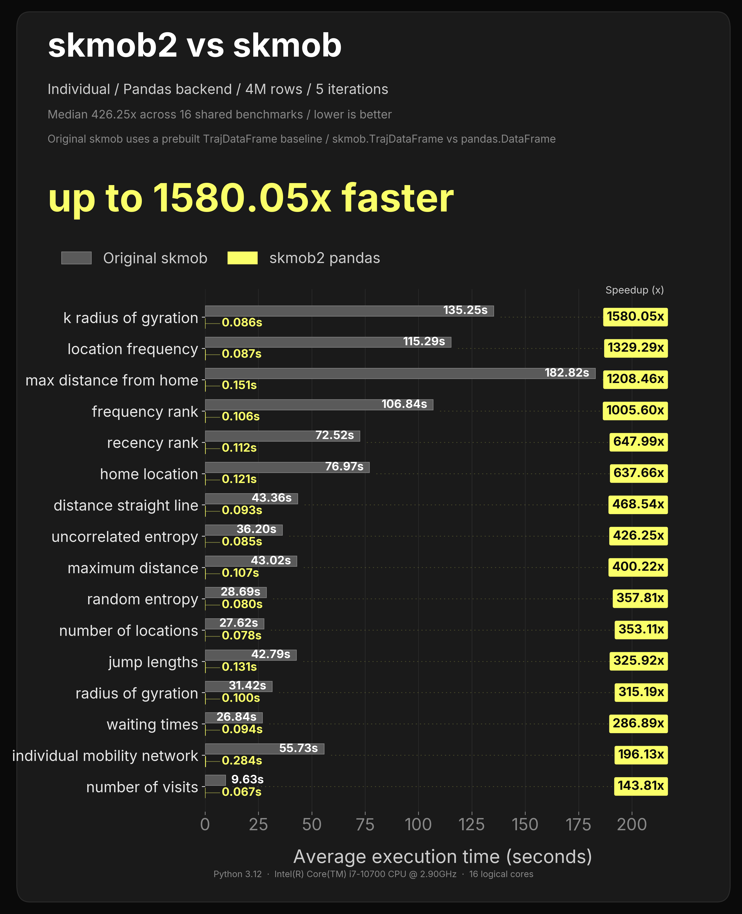

#### Measures - Individual - Pandas (Memory)
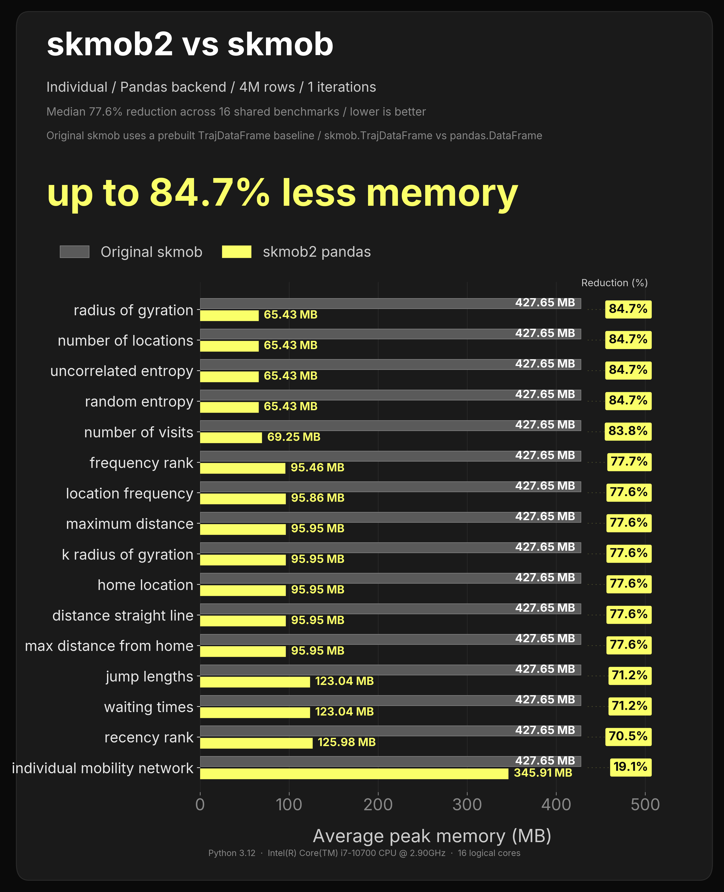

#### Measures - Individual - Polars (Speed)
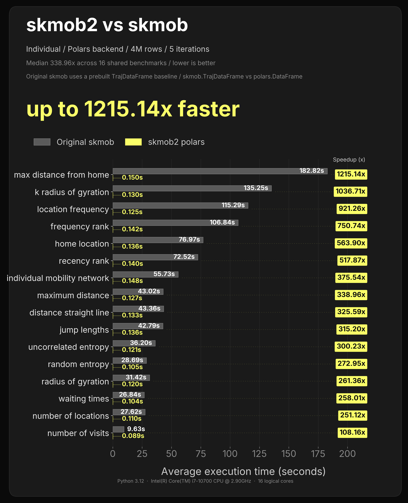

#### Measures - Individual - Polars (Memory)
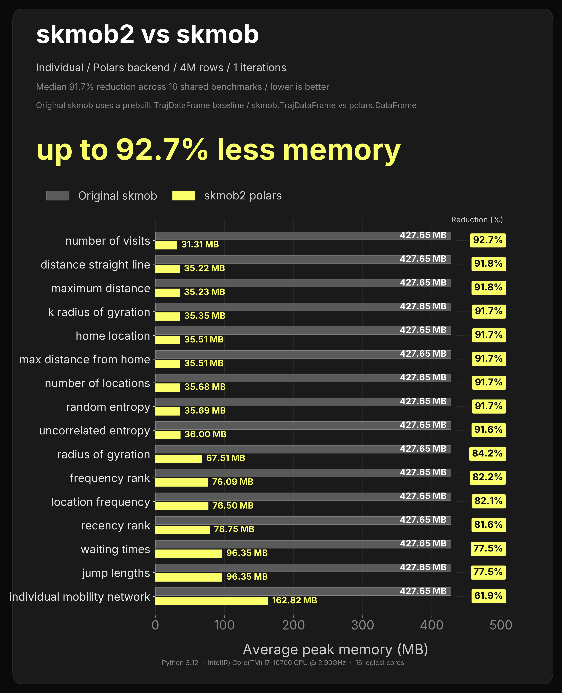

## Measures - Collective

#### Measures - Collective - Pandas (Speed)
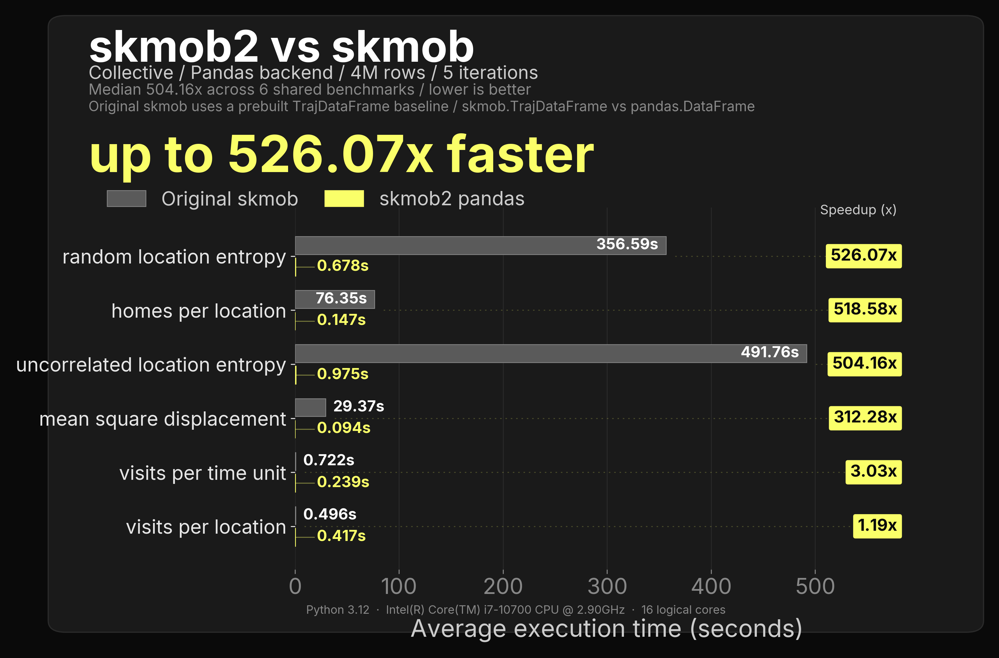

#### Measures - Collective - Pandas (Memory)
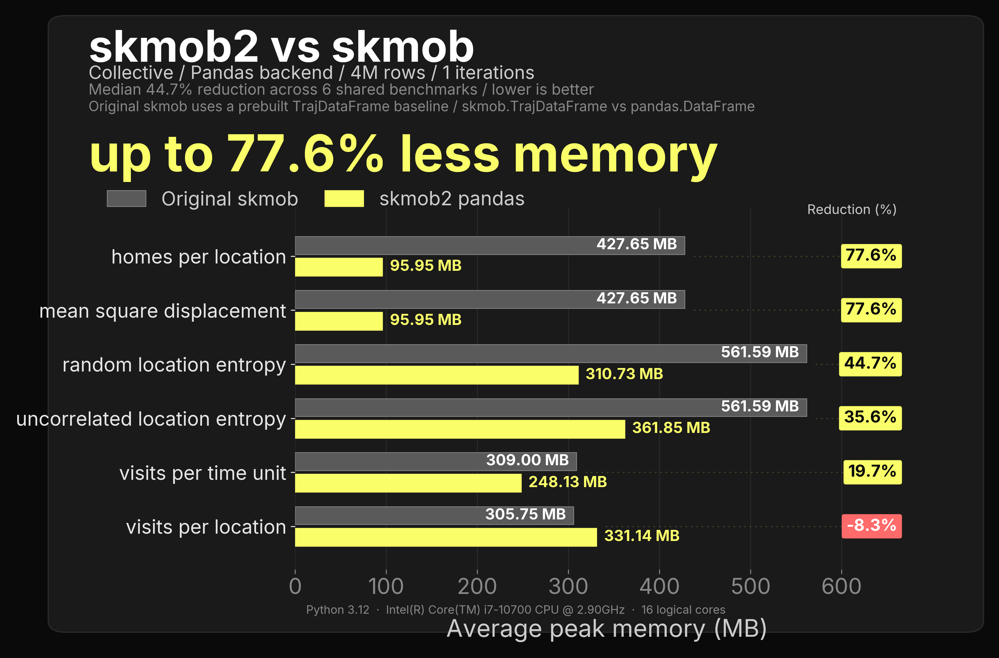

#### Measures - Collective - Polars (Speed)
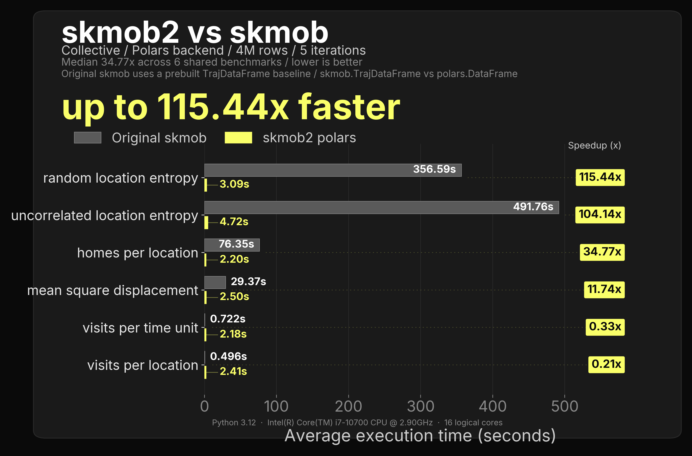

#### Measures - Collective - Polars (Memory)
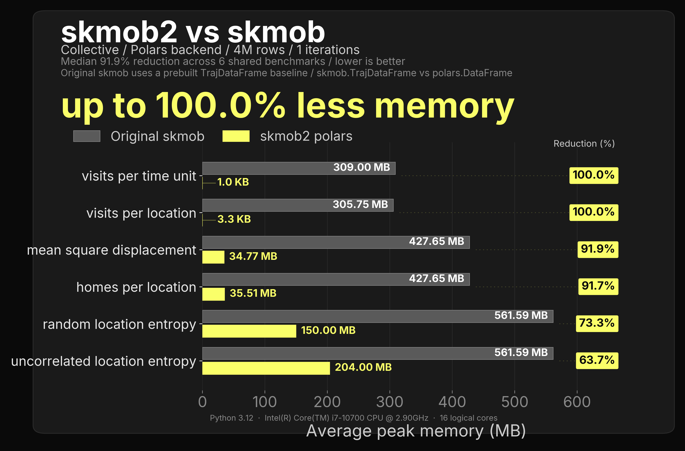

## Measures - Evaluation

#### Measures - Evaluation - Pandas (Speed)

#### Measures - Evaluation - Pandas (Memory)

#### Measures - Evaluation - Polars (Speed)

#### Measures - Evaluation - Polars (Memory)

## Models

#### Models - Pandas (Speed)

#### Models - Pandas (Memory)

#### Models - Polars (Speed)

#### Models - Polars (Memory)

## Privacy

#### Privacy - Pandas (Speed)

#### Privacy - Pandas (Memory)

#### Privacy - Polars (Speed)

Privacy - Polars (Memory)

## Pre-Sorted Benchmark Results

These refer to special metrics which benefit from sorted paths.

### Preprocessing

#### Preprocessing - Pandas (Speed)

#### Preprocessing - Pandas (Memory)

#### Preprocessing - Polars (Speed)

#### Preprocessing - Polars (Memory)

## Measures - Individual

#### Measures - Individual - Pandas (Speed)

#### Measures - Individual - Pandas (Memory)

#### Measures - Individual - Polars (Speed)

#### Measures - Individual - Polars (Memory)

## Measures - Collective

#### Measures - Collective - Pandas (Speed)

#### Measures - Collective - Pandas (Memory)

#### Measures - Collective - Polars (Speed)

#### Measures - Collective - Polars (Memory)

## Measures - Evaluation

#### Measures - Evaluation - Pandas (Speed)

#### Measures - Evaluation - Pandas (Memory)

#### Measures - Evaluation - Polars (Speed)

#### Measures - Evaluation - Polars (Memory)

## Models

#### Models - Pandas (Speed)

#### Models - Pandas (Memory)

#### Models - Polars (Speed)

#### Models - Polars (Memory)

## Privacy

#### Privacy - Pandas (Speed)

#### Privacy - Pandas (Memory)

#### Privacy - Polars (Speed)

#### Privacy - Polars (Memory)
